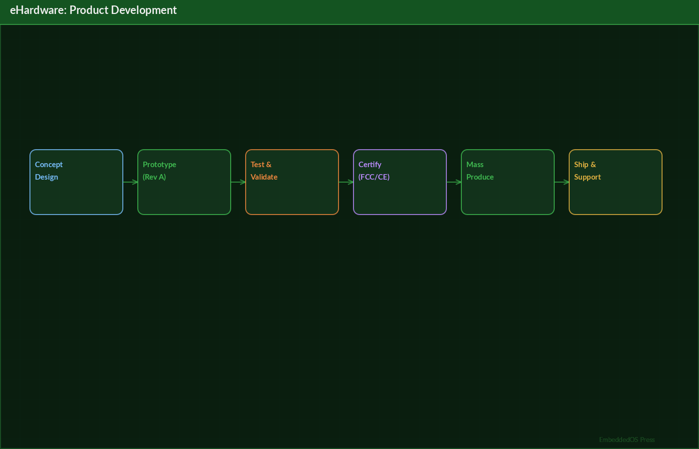
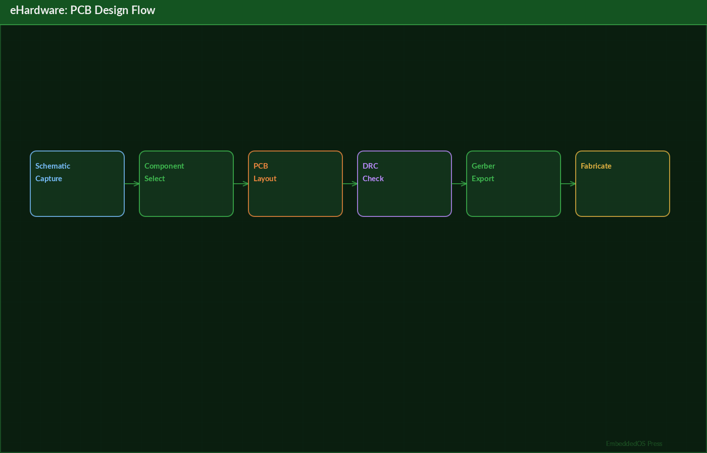

<!-- eHardware — EmbeddedOS Hardware Design Products: Product Reference -->
<!-- Generated: April 2026 -->

---

# eHardware — EmbeddedOS Hardware Design Products

## Product Reference





**By Srikanth Patchava & EmbeddedOS Contributors**

**April 2026 — First Edition**

**License: Proprietary — EmbeddedOS Organization**

---

> *"Hardware is the foundation upon which all great embedded systems are built."*

---

**Publisher:** EmbeddedOS Organization

**Repository:** `eHardware-Designs-Products`

**Ecosystem:** EmbeddedOS (eos, eAI, eNI, eBoot, ebuild, EoSim, eApps)

**Classification:** Internal Technical Reference

---

# Preface

Welcome to the **eHardware Product Reference**, the definitive technical guide for
the EmbeddedOS hardware product line. This book serves as a comprehensive reference
for engineers, designers, product managers, and manufacturing partners working with
the eHardware ecosystem.

The EmbeddedOS organization develops a vertically integrated hardware-software
platform spanning automotive radar [@skolnik2008], wearable [@patel2012] health monitoring, and personal air
mobility. Each product line is designed from first principles with full KiCad [@kicad_eda]
schematics, netlists, PCB layouts, 3D mechanical models, bills of materials, and
production-ready manufacturing documentation.

## Scope of This Book


This reference covers three major product lines:

1. **eRadar360** — A 120mm × 85mm automotive driver awareness radar with a 10-layer
   hybrid PCB and phased-array antenna design for advanced driver-assistance systems
   (ADAS).

2. **eHealth365** — A two-device health monitoring system comprising the Smart Ring Pro,
   Smart Patch Pro, and a companion mobile application, collectively covering approximately
   90% of all measurable health metrics.

3. **ePAM** — The Personal Air Mobility platform, consisting of four vehicle types: Eco Car,
   Urban Drone eVTOL, Space Shuttle, and Combo Unit, unified by a shared power [@erickson2005] architecture
   and the ULP-SSN avionics board.

Each chapter provides detailed hardware specifications, schematic descriptions, BOM
breakdowns, PCB stackup details, manufacturing notes, and integration guidance.

## How to Use This Book

- **Hardware Engineers:** Focus on Chapters 2–9 for detailed schematic and PCB design
  information, and Chapter 11 for KiCad workflow guidance.
- **Manufacturing Teams:** Chapter 12 provides assembly procedures, quality control
  checklists, and pick-and-place specifications.
- **Mechanical Engineers:** Chapter 13 covers 3D models, enclosure design, and form
  factor specifications.
- **Product Managers:** Chapter 14 details business plans, pricing, go-to-market
  strategies, and regulatory pathways.
- **DevOps/CI Engineers:** Chapter 15 describes the automated hardware design validation
  pipeline.
- **All Readers:** The appendices provide quick-reference BOM tables, PCB stackup
  specifications, and regulatory compliance information.

## Prerequisites

To work with the design files referenced in this book, you will need:

- **KiCad 7.0+** — For opening and editing schematics (.kicad_sch), netlists (.net),
  and PCB layouts
- **Python 3.10+** — For running BOM generation scripts, validation tools, and CI
  pipelines
- **A modern web browser** — For viewing interactive HTML schematics
- **3D CAD software** (optional) — For importing and modifying mechanical models

## Acknowledgments

This book would not be possible without the contributions of the entire EmbeddedOS
community, including firmware engineers (eos), AI/ML specialists (eAI), neural interface
researchers (eNI), bootloader developers (eBoot), build system maintainers (ebuild),
simulator designers (EoSim), and mobile app developers (eApps).

---

# Chapter 1: Introduction to eHardware

## 1.1 Vision

The EmbeddedOS hardware platform represents a unified approach to embedded systems
design, where every product shares common design principles, toolchains, and
manufacturing processes. Our vision is to create hardware that is:

- **Open in process, proprietary in implementation** — Full documentation of design
  methodology while protecting production-ready designs
- **Vertically integrated** — From schematic capture to firmware deployment in a single
  ecosystem
- **Manufacturing-ready** — Every design includes complete BOM, pick-and-place files,
  and production notes
- **Validated by CI/CD** — Automated checks ensure design integrity from commit to
  production

## 1.2 Product Portfolio Overview

The eHardware product portfolio spans three distinct markets:

### 1.2.1 Automotive (eRadar360)

The eRadar360 is a compact radar sensor module designed for automotive ADAS
applications. It operates in the 76–81 GHz frequency band and provides 360-degree
environmental awareness for collision avoidance, blind-spot detection, and adaptive
cruise control.

| Parameter | Specification |
|-----------|---------------|
| Dimensions | 120mm × 85mm |
| PCB Layers | 10-layer hybrid |
| Frequency Band | 76–81 GHz |
| Detection Range | Up to 250m |
| Field of View | 360° (multi-sensor fusion) |
| Interface | CAN-FD, Automotive Ethernet |

### 1.2.2 Health & Wellness (eHealth365)

The eHealth365 system achieves ~90% health metric coverage through just two wearable
devices and a companion mobile application:

| Device | Form Factor | Key Metrics | Battery Life |
|--------|-------------|-------------|--------------|
| Smart Ring Pro | Titanium, 2.5mm wide, 4g | HR/HRV, SpO2, temp, accelerometer, ketones, skin conductance | 4–5 days |
| Smart Patch Pro | 40×30mm, 3.5mm thin | CGM glucose, sweat electrolytes, bioimpedance, blood cartridge | 7-day patch |
| Mobile App | iOS/Android | AI food camera, health score, hydration reminders | N/A |

### 1.2.3 Personal Air Mobility (ePAM)

The ePAM platform defines four vehicle categories with a shared power architecture:

| Vehicle | Seats | Range | Price Range | Status |
|---------|-------|-------|-------------|--------|
| Eco Car | 4–5 | 500–900 km | $28–45K | Phase 1 (2025–27) |
| Urban Drone | 4 | 300–500 km | $85–120K | Phase 2 (2027–30) |
| Space Shuttle | 4 | 100 km altitude | $2–4M | Phase 3 (2030+) |
| Combo Unit | 4 | Trans-atmospheric | $5–9M | Phase 3 (2030+) |

## 1.3 Repository Structure

Each product directory in the `eHardware-Designs-Products` repository contains:

```
product-name/
├── schematics/
│   ├── *.kicad_sch          # KiCad schematic files
│   ├── *.net                # Netlist exports
│   └── interactive.html     # Browser-viewable schematics
├── pcb/
│   ├── stackup.txt          # Layer stackup specification
│   └── layout.kicad_pcb     # PCB layout (if applicable)
├── bom/
│   └── bom.csv              # Bill of materials
├── mechanical/
│   └── 3d-models.md         # 3D model references and specs
├── docs/
│   ├── datasheet.md         # Product datasheet
│   ├── manufacturing.md     # Manufacturing and assembly notes
│   └── business-plan.md     # Business plan and go-to-market
└── app/
    └── architecture.md      # Mobile app architecture (if applicable)
```

## 1.4 Design Philosophy

All eHardware products follow these core design principles:




1. **Design for Manufacturing (DFM):** Every schematic decision considers
   manufacturability, component availability, and assembly yield.

2. **Design for Test (DFT):** Test points, boundary scan, and diagnostic interfaces
   are included in every board design.

3. **Thermal Management:** Thermal simulations and heat dissipation strategies are
   integral to every PCB layout.

4. **EMC [@paul2006] Compliance:** Electromagnetic compatibility is addressed at the schematic
   level through proper grounding, shielding, and filtering.

5. **Supply Chain Resilience:** BOMs include alternate components and second-source
   options for critical parts.

## 1.5 Related Ecosystem Repositories

The eHardware designs integrate with several companion repositories:

| Repository | Purpose | Integration Point |
|------------|---------|-------------------|
| `eos` | Firmware / RTOS | Runs on eHardware MCUs and FPGAs |
| `eAI` | AI inference engine | On-device ML for radar and health |
| `eNI` | Neural interface | Future brain-computer interface HW |
| `eBoot` | Bootloader | Secure boot for all eHardware products |
| `ebuild` | Build system | Firmware compilation and flashing |
| `EoSim` | Hardware simulator | Pre-silicon validation and testing |
| `eApps` | Mobile applications | Companion apps for eHealth365 and ePAM |

---

# Chapter 2: eRadar360 — Driver Awareness Radar

> **Note:** The eRadar360 design files (schematics, BOM, PCB layout) have moved to a standalone repository:
> [embeddedos-org/eRadar360_CAD](https://github.com/embeddedos-org/eRadar360_CAD).
> The documentation below is retained for reference.

## 2.1 Product Overview

The eRadar360 is a compact, high-performance millimeter-wave radar module designed
for automotive advanced driver-assistance systems (ADAS). Operating in the 76–81 GHz
band, it provides reliable object detection, classification, and tracking in all
weather conditions.

## 2.2 System Architecture

The eRadar360 system consists of the following major subsystems:

```
┌─────────────────────────────────────────────────┐
│                  eRadar360 Module                │
│                                                  │
│  ┌──────────┐  ┌──────────┐  ┌──────────────┐  │
│  │  Radar   │  │  Signal  │  │  Automotive  │  │
│  │  Sensor  │──│ Process- │──│  Interface   │  │
│  │  Array   │  │   ing    │  │  (CAN-FD)    │  │
│  └──────────┘  └──────────┘  └──────────────┘  │
│       │              │              │            │
│  ┌──────────┐  ┌──────────┐  ┌──────────────┐  │
│  │ Antenna  │  │   DSP    │  │   Power      │  │
│  │  Array   │  │  Engine  │  │  Management  │  │
│  └──────────┘  └──────────┘  └──────────────┘  │
└─────────────────────────────────────────────────┘
```

## 2.3 PCB Specifications

### 2.3.1 Board Dimensions

- **Width:** 120mm
- **Height:** 85mm
- **Thickness:** 1.6mm (nominal)
- **Weight:** ~45g (bare board)

### 2.3.2 10-Layer Hybrid Stackup

The eRadar360 uses a 10-layer hybrid PCB stackup optimized for high-frequency
RF signal integrity [@johnson2003] and mixed-signal isolation:

| Layer | Name | Type | Material | Thickness (µm) | Purpose |
|-------|------|------|----------|-----------------|---------|
| L1 | TOP | Signal | Copper | 35 | RF antenna elements, high-speed signals |
| — | PP1 | Prepreg | Rogers RO4350B | 200 | Low-loss RF dielectric |
| L2 | GND1 | Plane | Copper | 35 | RF ground plane |
| — | Core1 | Core | FR-4 | 200 | Structural core |
| L3 | SIG1 | Signal | Copper | 35 | Digital high-speed routing |
| — | PP2 | Prepreg | FR-4 | 150 | Standard dielectric |
| L4 | PWR1 | Plane | Copper | 35 | 3.3V power plane |
| — | Core2 | Core | FR-4 | 200 | Structural core |
| L5 | GND2 | Plane | Copper | 35 | Digital ground plane |
| — | PP3 | Prepreg | FR-4 | 150 | Standard dielectric |
| L6 | SIG2 | Signal | Copper | 35 | Analog signal routing |
| — | Core3 | Core | FR-4 | 200 | Structural core |
| L7 | PWR2 | Plane | Copper | 35 | 1.8V / 1.2V power plane |
| — | PP4 | Prepreg | FR-4 | 150 | Standard dielectric |
| L8 | SIG3 | Signal | Copper | 35 | Low-speed digital, I2C, SPI |
| — | Core4 | Core | FR-4 | 200 | Structural core |
| L9 | GND3 | Plane | Copper | 35 | Analog ground plane |
| — | PP5 | Prepreg | Rogers RO4350B | 200 | Low-loss RF dielectric |
| L10 | BOT | Signal | Copper | 35 | RF feeds, connectors, test points |

**Key Design Decisions:**
- Rogers RO4350B material on outer prepreg layers for low RF loss (Dk = 3.48, Df = 0.0037)
- FR-4 for inner layers to reduce cost while maintaining structural integrity
- Dedicated ground planes (L2, L5, L9) provide isolation between RF, digital, and analog domains
- Separate power planes for 3.3V (L4) and 1.8V/1.2V (L7) rail distribution

### 2.3.3 Impedance Control

| Trace Type | Impedance (Ω) | Width (mil) | Layer |
|------------|---------------|-------------|-------|
| 50Ω microstrip | 50 ± 5% | 8.5 | L1, L10 |
| 100Ω differential | 100 ± 10% | 5/5 (gap 5) | L3 |
| 90Ω differential (USB) | 90 ± 10% | 5.5/5.5 (gap 4.5) | L8 |
| Standard digital | N/A | 6 (min) | L3, L6, L8 |

## 2.4 Radar Sensor Array

### 2.4.1 Sensor Configuration

The eRadar360 employs a MIMO (Multiple-Input, Multiple-Output) radar configuration:

- **Transmit antennas:** 3 TX elements
- **Receive antennas:** 4 RX elements
- **Virtual array:** 12 virtual channels (3 × 4)
- **Chirp bandwidth:** Up to 4 GHz (76–80 GHz)
- **Range resolution:** ~3.75 cm
- **Maximum unambiguous range:** 250m
- **Velocity resolution:** ~0.1 m/s
- **Angular resolution:** ~1° (azimuth), ~5° (elevation)

### 2.4.2 Key Components

| Component | Part Number | Description | Qty |
|-----------|-------------|-------------|-----|
| Radar Transceiver | AWR2243BOOST | TI 76–81 GHz FMCW radar transceiver | 1 |
| Radar MCU | AWR2243 companion DSP | Signal processing and FFT engine | 1 |
| LNA | HMC-ALH369 | Low-noise amplifier, 75–85 GHz | 4 |
| Power Amplifier | HMC-AUH320 | PA, 75–85 GHz, 15 dBm output | 3 |
| Phase Shifter | MAPH-011027 | 6-bit digital phase shifter | 7 |
| PLL/Synthesizer | ADF4159 | Fractional-N frequency synthesizer | 1 |
| CAN-FD Transceiver | TCAN4550-Q1 | Automotive CAN-FD interface | 1 |
| Ethernet PHY | TJA1100 | 100BASE-T1 automotive Ethernet | 1 |

## 2.5 Antenna Design

### 2.5.1 Antenna Topology

The eRadar360 uses a series-fed microstrip patch antenna array implemented directly
on the PCB top layer (L1) using Rogers RO4350B as the dielectric substrate.

**Design Parameters:**
- **Element type:** Rectangular microstrip patch
- **Feed network:** Series-fed with quarter-wave transformers
- **Patch dimensions:** 1.8mm × 1.4mm (per element)
- **Element spacing:** λ/2 = 1.9mm at 79 GHz
- **Array configuration:** 1×8 linear array per TX/RX channel
- **Polarization:** Linear (vertical)
- **Gain:** ~15 dBi per sub-array
- **3 dB beamwidth:** 12° (H-plane), 80° (E-plane)
- **Sidelobe level:** < -20 dB (with Taylor weighting)

### 2.5.2 RF Front-End Block Diagram

```
TX Path:
  PLL (ADF4159) → Radar Transceiver (AWR2243) → PA (HMC-AUH320)
  → Phase Shifter → TX Antenna Array

RX Path:
  RX Antenna Array → LNA (HMC-ALH369) → Phase Shifter
  → Radar Transceiver (AWR2243) → ADC → DSP
```

## 2.6 Signal Processing Pipeline

1. **Chirp Generation:** FMCW chirp signal generated by ADF4159 PLL
2. **Transmission:** Chirp transmitted via 3 TX antennas sequentially (TDM-MIMO)
3. **Reception:** Reflected signals received on 4 RX channels simultaneously
4. **Dechirp/Mixing:** Beat frequency generated by mixing TX and RX signals
5. **ADC Sampling:** 12-bit ADC at 25 MSPS per channel
6. **Range FFT:** 1D FFT to extract range information
7. **Doppler FFT:** 2D FFT across chirps for velocity extraction
8. **Angle FFT:** 3D FFT across virtual array for angular estimation
9. **CFAR Detection:** Constant False Alarm Rate detection for target identification
10. **Tracking:** Extended Kalman Filter for multi-target tracking

## 2.7 Automotive Interface

The eRadar360 provides two automotive communication interfaces:

**CAN-FD (Primary):**
- Baud rate: 500 Kbps (arbitration), 2 Mbps (data phase)
- Message format: Custom radar object list (up to 64 tracked objects)
- Update rate: 50 ms cycle time

**Automotive Ethernet (Secondary):**
- 100BASE-T1 single-pair Ethernet
- Raw point cloud streaming at 20 fps
- AUTOSAR-compatible software interface

## 2.8 Power Supply Architecture

| Rail | Voltage | Current (typ) | Regulator | Purpose |
|------|---------|---------------|-----------|---------|
| VIN | 9–16V DC | — | Input from vehicle | Automotive power input |
| 5V0 | 5.0V | 500 mA | TPS54560-Q1 | Intermediate rail |
| 3V3 | 3.3V | 800 mA | TPS7A8300-Q1 | Digital logic, CAN, Ethernet |
| 1V8 | 1.8V | 1.2 A | TPS62913 | Radar transceiver core |
| 1V2 | 1.2V | 600 mA | TPS62088 | DSP core voltage |
| VRF | 3.3V (filtered) | 200 mA | TPS7A47-Q1 | RF front-end (ultra-low noise) |

Total power consumption: ~8W typical, 12W peak.

---

# Chapter 3: eHealth365 — Smart Ring Pro

## 3.1 Product Overview

The Smart Ring Pro is a titanium wearable ring that provides continuous health
monitoring through an array of miniaturized sensors. At just 2.5mm wide and
weighing only 4 grams, it is designed for 24/7 wear with a 4–5 day battery life
and wireless recharging.

## 3.2 Mechanical Specifications

| Parameter | Specification |
|-----------|---------------|
| Material | Grade 5 Titanium (Ti-6Al-4V) |
| Width | 2.5mm |
| Weight | 4g (size 10) |
| Sizes | US 5–13 (half sizes available) |
| Water Resistance | IP68 (50m) |
| Operating Temp | -10°C to +50°C |
| Finish | Brushed titanium, matte black, rose gold PVD |

## 3.3 Sensor Suite

The Smart Ring Pro integrates six sensor modalities:

### 3.3.1 Heart Rate / Heart Rate Variability (HR/HRV)

- **Sensor:** Custom dual-wavelength PPG (photoplethysmography)
- **LEDs:** Green (525nm) + IR (940nm)
- **Photodetector:** Broadcom AFBR-S50 ambient light rejecting
- **Sampling rate:** 25 Hz (continuous), 250 Hz (spot check)
- **HR accuracy:** ±2 BPM (resting), ±5 BPM (exercise)
- **HRV metrics:** SDNN, RMSSD, pNN50, LF/HF ratio

### 3.3.2 Blood Oxygen Saturation (SpO2)

- **Method:** Reflective pulse oximetry (red 660nm + IR 940nm)
- **Accuracy:** ±2% (SpO2 70–100%)
- **Measurement interval:** Every 10 minutes (auto), on-demand spot check
- **Sensor placement:** Inner ring surface, flush-mounted optical window

### 3.3.3 Skin Temperature

- **Sensor:** Melexis MLX90632 medical-grade IR thermometer
- **Accuracy:** ±0.1°C (in 20–42°C range)
- **Resolution:** 0.02°C
- **Measurement:** Continuous trending, not absolute body temperature
- **Use cases:** Ovulation tracking, illness detection, circadian rhythm

### 3.3.4 Accelerometer

- **Sensor:** Bosch BMA456 tri-axis MEMS accelerometer
- **Range:** ±2g / ±4g / ±8g / ±16g (configurable)
- **Resolution:** 16-bit
- **Sampling rate:** 100 Hz
- **Features:** Step counting, activity classification, sleep staging, gesture detection

### 3.3.5 Ketone Breath Port

- **Sensor:** Custom MEMS gas sensor (acetone-selective MOx)
- **Detection range:** 0.5–50 ppm acetone
- **Correlation:** Mapped to blood BHB levels (0.1–8.0 mmol/L)
- **Measurement:** On-demand (exhale near ring)
- **Port:** 0.5mm micro-port on ring outer edge

### 3.3.6 Skin Conductance (EDA)

- **Sensor:** Dual-electrode galvanic skin response
- **Electrode material:** Gold-plated titanium
- **Measurement range:** 0.01–100 µS
- **Sampling rate:** 4 Hz
- **Applications:** Stress detection, emotional response, sleep quality

## 3.4 Electronics Architecture

### 3.4.1 Block Diagram

```
┌──────────────────────────────────────────────┐
│              Smart Ring Pro PCB               │
│                                               │
│  ┌─────────┐  ┌──────────┐  ┌────────────┐  │
│  │  PPG    │  │  Temp    │  │  Ketone    │  │
│  │ (HR/O2) │  │ (IR)     │  │  (MOx)     │  │
│  └────┬────┘  └────┬─────┘  └─────┬──────┘  │
│       │             │              │          │
│  ┌────┴─────────────┴──────────────┴──────┐  │
│  │        Nordic nRF5340 SoC              │  │
│  │  (Cortex-M33 app + Cortex-M33 net)    │  │
│  └────┬────────────────────────────┬──────┘  │
│       │                            │          │
│  ┌────┴────┐  ┌──────────┐  ┌─────┴──────┐  │
│  │  Accel  │  │  EDA     │  │  BLE 5.3   │  │
│  │ BMA456  │  │ Electrodes│  │  Antenna   │  │
│  └─────────┘  └──────────┘  └────────────┘  │
│                                               │
│  ┌──────────┐  ┌──────────────────────────┐  │
│  │  PMIC    │  │  Li-Po Battery 25 mAh   │  │
│  │ BQ25125  │  │  + Wireless Rx Coil      │  │
│  └──────────┘  └──────────────────────────┘  │
└──────────────────────────────────────────────┘
```

### 3.4.2 Core Processor

- **SoC:** Nordic Semiconductor nRF5340
- **Application core:** Arm Cortex-M33, 128 MHz, 1 MB Flash, 512 KB RAM
- **Network core:** Arm Cortex-M33, 64 MHz, 256 KB Flash, 64 KB RAM
- **Wireless:** Bluetooth 5.3, BLE, Direction Finding, Thread, Zigbee
- **Peripherals:** QSPI, SPI, I2C, UART, PDM, I2S, ADC (12-bit, 8-channel)
- **Security:** Arm TrustZone, CryptoCell-312

### 3.4.3 Power Management

| Component | Description |
|-----------|-------------|
| PMIC | TI BQ25125 ultra-low-power battery charger |
| Battery | 25 mAh Li-Po (custom form factor) |
| Wireless charging | Qi-compatible, 5W receiver coil |
| Voltage rails | 1.8V (SoC core), 3.0V (sensors), 3.3V (BLE PA) |
| Sleep current | < 5 µA (deep sleep with RTC active) |
| Active current | ~3 mA (continuous HR monitoring) |
| Battery life | 4–5 days typical usage |

## 3.5 PCB Design

### 3.5.1 Form Factor

The Smart Ring Pro PCB is a flexible-rigid hybrid design:

- **Rigid sections:** 2 rigid islands (MCU island + sensor island)
- **Flexible section:** Polyimide flex connecting rigid islands
- **Dimensions:** 55mm × 4mm (unfolded), wraps into ring inner circumference
- **Layer count:** 4 layers (rigid), 2 layers (flex)
- **Minimum trace/space:** 3 mil / 3 mil
- **Via type:** Laser-drilled microvias (0.1mm drill, 0.25mm pad)

### 3.5.2 Rigid-Flex Stackup

| Layer | Rigid Section | Flex Section |
|-------|---------------|--------------|
| L1 | Signal (Cu 18µm) | Signal (Cu 12µm) |
| — | Prepreg (FR-4, 100µm) | Adhesive (25µm) |
| L2 | GND Plane (Cu 18µm) | GND (Cu 12µm) |
| — | Core (FR-4, 200µm) | Polyimide (50µm) |
| L3 | Power Plane (Cu 18µm) | — |
| — | Prepreg (FR-4, 100µm) | — |
| L4 | Signal (Cu 18µm) | — |

## 3.6 BOM Summary

| Category | Components | Est. Cost (1K units) |
|----------|------------|---------------------|
| MCU/SoC | nRF5340 | $4.50 |
| Sensors | PPG + Temp + Accel + EDA + Ketone | $8.20 |
| Power | PMIC + Battery + Wireless Rx | $3.80 |
| Passives | Capacitors, resistors, inductors | $1.50 |
| RF | BLE antenna, matching network | $0.80 |
| Mechanical | Titanium shell, optical windows | $22.00 |
| PCB | 4L rigid-flex, ENIG finish | $6.50 |
| **Total BOM** | | **~$47.30** |

Retail price: **$299** (margin accounts for assembly, test, packaging, warranty).

## 3.7 Manufacturing Notes

- **Assembly:** Automated SMT placement on rigid sections; flex bonding with
  pressure-sensitive adhesive
- **Testing:** 100% functional test (BLE connection, sensor readings, charge circuit)
- **Optical alignment:** Laser-aligned PPG sensor window with ±0.05mm tolerance
- **Sealing:** Ultrasonic welding of titanium shell halves with silicone gasket
- **ESD protection:** All external interfaces protected to ±8 kV contact discharge

---

# Chapter 4: eHealth365 — Smart Patch Pro

## 4.1 Product Overview

The Smart Patch Pro is a disposable-adhesive wearable patch designed for the upper
arm. At 40mm × 30mm and only 3.5mm thin, it provides continuous glucose monitoring
(CGM), sweat electrolyte analysis, bioimpedance hydration measurement, and monthly
blood analysis through a replaceable cartridge system.

## 4.2 Physical Specifications

| Parameter | Specification |
|-----------|---------------|
| Dimensions | 40mm × 30mm × 3.5mm |
| Weight | 8g (without cartridge) |
| Adhesive | Medical-grade hydrocolloid, 7-day wear |
| Cartridge | Monthly blood analysis cartridge (snap-on) |
| Water Resistance | IPX7 (30 min at 1m) |
| Skin Contact | Biocompatible silicone interface |

## 4.3 Sensor Suite

### 4.3.1 Continuous Glucose Monitor (CGM)

- **Method:** Electrochemical enzymatic sensing (glucose oxidase)
- **Filament:** 5mm subcutaneous insertion, 0.3mm diameter
- **Range:** 40–500 mg/dL
- **Accuracy:** MARD < 9%
- **Warm-up time:** 60 minutes after insertion
- **Calibration:** Factory-calibrated, no finger-prick needed
- **Measurement interval:** Every 1 minute (continuous)

### 4.3.2 Sweat Electrolyte Sensors

- **Analytes:** Sodium (Na+), Potassium (K+), Magnesium (Mg2+), Zinc (Zn2+)
- **Method:** Ion-selective electrode (ISE) array
- **Sodium range:** 10–200 mM
- **Potassium range:** 1–50 mM
- **Iontophoretic stimulation:** Pilocarpine-based sweat induction
- **Minimum sweat volume:** 0.5 µL
- **Measurement interval:** Every 15 minutes (during active sweating)

### 4.3.3 Bioimpedance (Hydration)

- **Method:** Multi-frequency bioelectrical impedance analysis (BIA)
- **Frequencies:** 5 kHz, 50 kHz, 200 kHz, 1 MHz
- **Electrodes:** 4-electrode (tetrapolar) configuration
- **Measurement:** Total body water estimation, extracellular/intracellular ratio
- **Accuracy:** ±3% of total body water
- **Interval:** Every 30 minutes

### 4.3.4 Monthly Blood Cartridge

The blood cartridge is a snap-on module that provides:

- **Sample method:** Single-prick lancet (integrated, spring-loaded)
- **Sample volume:** 50 µL capillary blood
- **Analytes:** Skin pH, lactate, vitamins (D, B12), iron, zinc, calcium, magnesium
- **Method:** Microfluidic lab-on-chip with colorimetric detection
- **Results:** Available in 5 minutes via app
- **Cartridge life:** Single use (monthly replacement)

## 4.4 Electronics Architecture

### 4.4.1 Core Components

| Component | Part Number | Description |
|-----------|-------------|-------------|
| MCU | nRF52840 | Nordic BLE 5.0 SoC, Cortex-M4F |
| AFE (CGM) | MAX30009 | Ultra-low-power biopotential AFE |
| AFE (Impedance) | AD5940 | High-precision impedance analyzer |
| ADC (Electrolytes) | ADS1220 | 24-bit delta-sigma ADC |
| Power | BQ25180 | Ultra-low-Iq battery charger |
| Battery | 80 mAh Li-Po | Thin-film, 0.5mm thickness |

### 4.4.2 PCB Design

- **Dimensions:** 35mm × 25mm (fits within patch enclosure)
- **Layers:** 6-layer rigid PCB
- **Material:** Standard FR-4, 0.8mm total thickness
- **Finish:** ENIG (gold pads for electrode contact)
- **Special features:** Exposed gold pads on bottom for skin electrode contact

### 4.4.3 Cartridge Interface

The blood cartridge connects via a 12-pin spring-loaded connector:

| Pin | Signal | Description |
|-----|--------|-------------|
| 1–2 | VCC/GND | Cartridge power supply (3.0V) |
| 3 | LANCET | Lancet trigger signal |
| 4–7 | AIN0–AIN3 | Analog inputs from colorimetric sensors |
| 8 | I2C_SDA | Cartridge EEPROM data |
| 9 | I2C_SCL | Cartridge EEPROM clock |
| 10 | DETECT | Cartridge insertion detection |
| 11 | LED_DRV | Colorimetric LED driver |
| 12 | TEMP | Cartridge temperature sensor |

## 4.5 Coverage Matrix

The combined Ring + Patch + App system covers:

| Metric | Ring | Patch | App | Method |
|--------|------|-------|-----|--------|
| Heart Rate / HRV | ✓ | | | PPG optical |
| SpO2 | ✓ | | | Pulse oximetry |
| Skin Temperature | ✓ | | | IR thermometer |
| Sleep Stages | ✓ | | | Accelerometer + HR |
| Steps / Activity | ✓ | | | Accelerometer |
| Stress Level | ✓ | | | HRV + EDA |
| Ketones | ✓ | | | Breath acetone |
| Hydration (Hint) | ✓ | | | Skin conductance trend |
| Blood Glucose | | ✓ | | CGM enzymatic |
| Sodium / Potassium | | ✓ | | Sweat ISE |
| Magnesium / Zinc | | ✓ | | Sweat ISE |
| Hydration (Precise) | | ✓ | | Bioimpedance |
| Skin pH | | ✓ | | Blood cartridge |
| Lactate | | ✓ | | Blood cartridge |
| Calories Burned | ✓ | | | HR + accelerometer |
| Vitamins (D, B12) | | ✓ | | Blood cartridge |
| Iron / Zinc / Calcium / Mg | | ✓ | | Blood cartridge |
| Calories In | | | ✓ | AI food camera |
| Hydration Reminders | | | ✓ | Algorithm + nudges |

**Total unique metrics:** ~20 across two devices and one app (~90% of measurable health metrics).

## 4.6 BOM Summary

| Category | Est. Cost (1K units) |
|----------|---------------------|
| MCU (nRF52840) | $3.80 |
| AFEs (MAX30009, AD5940) | $6.50 |
| ADC (ADS1220) | $2.10 |
| Sensors (CGM filament, ISE array) | $12.00 |
| Power (BQ25180, battery, charging) | $4.20 |
| Passives | $1.80 |
| PCB (6L rigid, ENIG) | $3.50 |
| Enclosure + adhesive | $5.00 |
| Blood cartridge (per unit) | $8.00 |
| **Total Patch BOM** | **~$46.90** |

---

# Chapter 5: eHealth365 — Mobile App and Data Architecture

## 5.1 App Overview

The eHealth365 mobile application is the central hub for data visualization,
AI-powered insights, and health management. It features a dark-theme dashboard
optimized for readability and minimal eye strain.

## 5.2 App Design

### 5.2.1 UI/UX Principles

- **Dark theme:** OLED-optimized dark background (#121212) with high-contrast text
- **Dashboard-first:** Single-screen overview with daily health score (0–100)
- **Contextual depth:** Tap any metric card to drill into historical trends
- **Accessibility:** WCAG 2.1 AA compliant, VoiceOver/TalkBack support

### 5.2.2 Key Screens

1. **Dashboard:** Daily health score, Ring metrics (top), Patch metrics (bottom)
2. **Trends:** 7-day, 30-day, 90-day, 1-year trend charts per metric
3. **AI Food Camera:** Point camera at food → instant calorie/macro estimation
4. **Hydration Tracker:** Water intake logging + AI-generated reminders
5. **Blood Results:** Monthly cartridge results with normal range indicators
6. **Settings:** Device management, notification preferences, data export

### 5.2.3 Daily Health Score Algorithm

The daily health score (0–100) is computed as a weighted composite:

```
Health Score = w1×HR_score + w2×HRV_score + w3×SpO2_score
             + w4×Sleep_score + w5×Activity_score + w6×Stress_score
             + w7×Glucose_score + w8×Hydration_score + w9×Nutrition_score

Default weights:
  w1=0.10, w2=0.12, w3=0.08, w4=0.15, w5=0.12,
  w6=0.10, w7=0.13, w8=0.10, w9=0.10
```

Each sub-score is normalized to 0–100 based on personalized baselines established
during the first 14 days of use.

## 5.3 Data Architecture

### 5.3.1 Data Flow

```
Smart Ring Pro ──BLE──┐
                      ├──→ Mobile App ──→ Cloud API ──→ Data Lake
Smart Patch Pro ──BLE─┘       │              │
                              │         ┌────┴────┐
                              │         │  AI/ML  │
                              │         │ Pipeline │
                              │         └────┬────┘
                              │              │
                              └──← Insights ←┘
```

### 5.3.2 Local Data Storage

- **Database:** SQLite (encrypted with SQLCipher)
- **Data retention:** 90 days on-device, unlimited in cloud
- **Sync frequency:** Real-time over BLE → batch upload every 5 minutes to cloud
- **Offline capability:** Full functionality for 30 days without internet

### 5.3.3 Cloud Architecture

- **API:** RESTful HTTPS with JWT authentication
- **Database:** TimescaleDB (time-series health data)
- **Object storage:** S3-compatible (raw sensor dumps, images)
- **ML inference:** ONNX Runtime on edge, TensorFlow Serving in cloud
- **HIPAA compliance:** End-to-end encryption, BAA with cloud providers

## 5.4 AI Food Camera

### 5.4.1 Technology

- **Model:** MobileNetV3-Large fine-tuned on 500K food images
- **Inference:** On-device (CoreML / TFLite), < 200ms latency
- **Accuracy:** 85% top-1 food recognition, ±15% calorie estimation
- **Database:** 12,000+ food items with USDA nutritional data
- **Features:** Multi-item detection, portion size estimation, barcode scanning

### 5.4.2 Calorie Estimation Pipeline

1. User captures food image
2. Object detection identifies individual food items
3. Semantic segmentation estimates portion sizes
4. Nutritional lookup from USDA database
5. User confirms/adjusts portions
6. Calories and macros logged to daily intake

## 5.5 Pricing Model

| Item | Price | Frequency |
|------|-------|-----------|
| Smart Ring Pro | $299 | One-time |
| Smart Patch Pro (starter kit) | $199 | One-time |
| Patch weekly refill (adhesive + sensors) | $15 | Weekly |
| Monthly blood cartridge | $25 | Monthly |
| App subscription | $9.99 | Monthly |
| **Total Year 1 cost** | **~$1,100** | |

---

# Chapter 6: ePAM — Eco Car

## 6.1 Product Overview

The Eco Car is a 4–5 seat solar-hybrid ground vehicle designed for maximum energy
efficiency and range. It combines solar panels, hydrogen fuel cells, solid-state
batteries, and kinetic regenerative braking into a unified power architecture.

## 6.2 Vehicle Specifications

| Parameter | Specification |
|-----------|---------------|
| Seating | 4–5 passengers |
| Price range | $28,000–$45,000 |
| Range | 500–900 km (combined power) |
| Top speed | 160 km/h |
| 0–100 km/h | 7.5 seconds |
| Curb weight | 1,450 kg |
| Drivetrain | Dual motor AWD |
| Motor power | 2 × 75 kW (150 kW total) |
| Torque | 2 × 220 Nm (440 Nm total) |

## 6.3 Power System

### 6.3.1 Solar Array

- **Type:** Monocrystalline silicon (SunPower Maxeon Gen 6)
- **Area:** 4.2 m² (roof + hood + trunk lid)
- **Efficiency:** 24.5%
- **Peak output:** 1,030 Wp
- **Daily yield:** 4–6 kWh (average sunlight conditions)
- **Integration:** Laminated into body panels, aerodynamic flush-mount

### 6.3.2 Solid-State Battery Pack

- **Chemistry:** Lithium-metal solid-state (sulfide electrolyte)
- **Capacity:** 80 kWh (usable)
- **Energy density:** 400 Wh/kg (cell level)
- **Voltage range:** 320–420V
- **Charging:** 150 kW DC fast charge (10–80% in 18 min)
- **Cycle life:** > 3,000 cycles to 80% capacity
- **Weight:** 200 kg

### 6.3.3 Hydrogen Fuel Cell (Range Extender)

- **Type:** PEM (Proton Exchange Membrane)
- **Power output:** 30 kW continuous
- **H2 storage:** 5 kg at 700 bar (Type IV carbon-fiber tank)
- **Range contribution:** +300 km
- **Refueling time:** 3–5 minutes

## 6.4 Electronics / Avionics

The Eco Car uses a simplified version of the ULP-SSN avionics board:

| Component | Description |
|-----------|-------------|
| Main ECU | Ambiq Apollo4 Blue Plus (Cortex-M4F, 192 MHz) |
| Motor Controller | Custom SiC MOSFET inverter (2x) |
| BMS | 96S battery management system |
| Solar MPPT | Custom maximum power point tracker |
| Fuel Cell Controller | PEM stack management ECU |
| Infotainment | Qualcomm SA8295P automotive SoC |
| ADAS Integration | eRadar360 module (optional) |
| Connectivity | 5G modem + Wi-Fi 6E + BLE 5.3 |

## 6.5 Schematic Overview

The Eco Car schematic is organized into the following sheets:

1. **Power Distribution:** Main battery bus, DC-DC converters, fuse box
2. **Motor Drive:** SiC inverter stages, gate drivers, current sensing
3. **BMS:** Cell monitoring ICs, balancing circuits, thermal management
4. **Solar MPPT:** Boost converter, IV curve tracking, bypass diodes
5. **Fuel Cell:** Stack monitoring, air compressor control, H2 flow regulation
6. **Vehicle Control:** Apollo4 MCU, CAN bus network, sensor interfaces
7. **Infotainment:** SA8295P SoC, display interfaces, audio amplifiers
8. **Charging:** CCS2 inlet, AC/DC on-board charger, V2G bidirectional

## 6.6 BOM Summary (Electronics)

| Category | Est. Cost |
|----------|-----------|
| MCU / ECU modules | $850 |
| Motor controllers (2x SiC inverter) | $2,400 |
| BMS (96S system) | $1,200 |
| Solar MPPT | $350 |
| Fuel cell controller | $600 |
| Infotainment SoC + display | $1,500 |
| Connectivity (5G, WiFi, BLE) | $280 |
| Sensors and actuators | $950 |
| Wiring harness | $800 |
| **Electronics subtotal** | **~$8,930** |

---

# Chapter 7: ePAM — Urban Drone eVTOL

## 7.1 Product Overview

The Urban Drone is a 4-seat electric vertical takeoff and landing (eVTOL) aircraft
designed for urban air mobility. It features eight tilt-rotor propulsion units for
efficient vertical and horizontal flight.

## 7.2 Vehicle Specifications

| Parameter | Specification |
|-----------|---------------|
| Seating | 4 passengers |
| Price range | $85,000–$120,000 |
| Range | 300–500 km |
| Cruise speed | 250 km/h |
| Max speed | 320 km/h |
| Service ceiling | 3,000 m (10,000 ft) |
| MTOW | 2,200 kg |
| Empty weight | 1,400 kg |
| Payload | 400 kg |

## 7.3 Propulsion System

### 7.3.1 Tilt-Rotor Configuration

- **Rotors:** 8× tilt-rotor units (4 front, 4 rear)
- **Rotor diameter:** 1.8m per unit
- **Motor type:** Axial flux permanent magnet (AFPM)
- **Motor power:** 50 kW per unit (400 kW total)
- **Tilt range:** 0° (vertical/hover) to 90° (horizontal/cruise)
- **Tilt actuator:** Brushless DC servo with absolute encoder
- **Redundancy:** Capable of controlled flight with 2 rotors failed (any combination)

### 7.3.2 Power Plant

| Source | Specification |
|--------|---------------|
| Primary battery | 120 kWh solid-state (Li-metal) |
| Fuel cell | 60 kW PEM, 8 kg H2 at 700 bar |
| Solar panels | 6 m² wing-integrated, 1.5 kWp |
| Regen braking | Autorotation energy recovery |

## 7.4 Flight Controller

The Urban Drone uses the full ULP-SSN avionics board (see Chapter 8 for details)
with flight-specific firmware:

### 7.4.1 Flight Control Architecture

```
┌─────────────────────────────────────────────┐
│            Flight Control System             │
│                                              │
│  ┌──────────┐  ┌──────────┐  ┌──────────┐  │
│  │  IMU     │  │   GPS    │  │  LIDAR   │  │
│  │ (9-axis) │  │ (RTK)    │  │ (Sense&  │  │
│  │          │  │          │  │  Avoid)  │  │
│  └────┬─────┘  └────┬─────┘  └────┬─────┘  │
│       └──────────────┼─────────────┘         │
│              ┌───────┴───────┐               │
│              │   ULP-SSN     │               │
│              │   Avionics    │               │
│              │  (Kintex +    │               │
│              │   Apollo4)    │               │
│              └───────┬───────┘               │
│       ┌──────────────┼─────────────┐         │
│  ┌────┴─────┐  ┌────┴─────┐  ┌────┴─────┐  │
│  │  Tilt    │  │  Motor   │  │  Comms   │  │
│  │ Servos   │  │  ESCs    │  │ (Telem)  │  │
│  └──────────┘  └──────────┘  └──────────┘  │
└─────────────────────────────────────────────┘
```

### 7.4.2 Sensor Suite

| Sensor | Model | Redundancy |
|--------|-------|------------|
| IMU | Analog Devices ADIS16507 | Triple redundant |
| GPS | u-blox ZED-F9P (RTK) | Dual redundant |
| Barometer | TE MS5611 | Dual redundant |
| Magnetometer | Honeywell HMC5983 | Dual redundant |
| LIDAR | Velodyne VLP-16 (sense & avoid) | Single |
| Pitot tube | Custom MEMS differential pressure | Dual redundant |
| Radar altimeter | eRadar360 derivative (downward) | Single |

## 7.5 BOM Summary (Avionics + Propulsion Electronics)

| Category | Est. Cost |
|----------|-----------|
| ULP-SSN avionics board | $4,500 |
| Motor ESCs (8x) | $6,400 |
| Tilt servo actuators (8x) | $3,200 |
| Sensor suite (IMU, GPS, baro, mag, LIDAR) | $8,500 |
| Battery pack (120 kWh solid-state) | $18,000 |
| Fuel cell system (60 kW PEM + H2 tank) | $12,000 |
| Solar panel integration | $2,800 |
| Wiring harness + connectors | $2,500 |
| Communication systems (4G/5G, ADS-B, radio) | $3,200 |
| **Electronics subtotal** | **~$61,100** |

---

# Chapter 8: ePAM — Space Shuttle

## 8.1 Product Overview

The Space Shuttle is a 4-seat suborbital vehicle capable of reaching 100 km altitude
(the Kármán line). It uses a solar-thermal rocket propulsion system and is controlled
by the ULP-SSN avionics platform — a 12-layer IPC [@ipc2221]-6012 Class 3 space/military-grade
circuit board.

## 8.2 Vehicle Specifications

| Parameter | Specification |
|-----------|---------------|
| Seating | 4 passengers (pressurized cabin) |
| Price | $2,000,000–$4,000,000 |
| Max altitude | 100+ km (suborbital) |
| Apogee time (weightlessness) | ~4 minutes |
| Max velocity | Mach 3.5 |
| Launch method | Vertical launch, horizontal landing |
| Propulsion | Solar-thermal rocket + auxiliary electric |
| Cabin pressure | 1 atm (sea level equivalent) |
| Life support | 6-hour closed-loop O2/CO2 system |

## 8.3 ULP-SSN Avionics Board

The **Ultra-Low-Power Space-grade Sensor/Navigation (ULP-SSN)** board is the central
avionics computer for all ePAM vehicles, designed to IPC-6012 Class 3 standards for
space and military applications.

### 8.3.1 Board Specifications

| Parameter | Specification |
|-----------|---------------|
| Standard | IPC-6012 Class 3 (Space/Military) |
| Dimensions | 160mm × 100mm |
| Layers | 12 |
| Material | Polyimide (high-Tg, radiation-tolerant) |
| Copper weight | 1 oz (inner), 2 oz (outer) |
| Finish | ENEPIG (Electroless Nickel Electroless Palladium Immersion Gold) |
| Via fill | Conductive epoxy fill, planarized |
| Min trace/space | 3 mil / 3 mil |
| Operating temp | -55°C to +125°C |
| Radiation tolerance | 50 krad TID (total ionizing dose) |

### 8.3.2 12-Layer Stackup

| Layer | Name | Type | Thickness (µm) | Purpose |
|-------|------|------|-----------------|---------|
| L1 | TOP | Signal | 70 (2 oz) | High-speed digital, connectors |
| — | PP1 | Prepreg | 100 | Polyimide prepreg |
| L2 | GND1 | Plane | 35 | Primary ground plane |
| — | C1 | Core | 150 | Polyimide core |
| L3 | SIG1 | Signal | 35 | FPGA high-speed I/O |
| — | PP2 | Prepreg | 100 | |
| L4 | PWR1 | Plane | 35 | FPGA core power (1.0V) |
| — | C2 | Core | 150 | |
| L5 | SIG2 | Signal | 35 | FPGA configuration, JTAG |
| — | PP3 | Prepreg | 100 | |
| L6 | GND2 | Plane | 35 | Mid-board ground plane |
| — | C3 | Core | 150 | |
| L7 | PWR2 | Plane | 35 | MCU power (1.8V, 3.3V) |
| — | PP4 | Prepreg | 100 | |
| L8 | SIG3 | Signal | 35 | MCU interfaces (SPI, I2C, UART) |
| — | C4 | Core | 150 | |
| L9 | GND3 | Plane | 35 | Analog ground plane |
| — | PP5 | Prepreg | 100 | |
| L10 | SIG4 | Signal | 35 | Analog sensor interfaces |
| — | C5 | Core | 150 | |
| L11 | PWR3 | Plane | 35 | Sensor power (3.3V analog) |
| — | PP6 | Prepreg | 100 | |
| L12 | BOT | Signal | 70 (2 oz) | Power components, connectors |

### 8.3.3 Core Processing

| Component | Part Number | Description |
|-----------|-------------|-------------|
| FPGA | Xilinx Kintex-7 XC7K325T | Main processing fabric, 326K logic cells |
| MCU | Ambiq Apollo4 Blue Plus | Ultra-low-power Cortex-M4F, 192 MHz |
| Configuration Flash | MT25QU256 | 256 Mbit QSPI NOR flash (FPGA bitstream) |
| SDRAM | IS42S32800J | 256 Mbit SDRAM for FPGA data buffering |
| EEPROM | CAT24C256 | 256 Kbit I2C EEPROM (calibration data) |

### 8.3.4 FPGA Resource Allocation

| Function | Logic Cells | Block RAM | DSP Slices |
|----------|-------------|-----------|------------|
| Navigation filter (EKF) | 45K | 120 KB | 32 |
| Guidance computer | 30K | 80 KB | 16 |
| Sensor fusion | 55K | 200 KB | 48 |
| Communication stack | 20K | 40 KB | 4 |
| Redundancy management | 35K | 60 KB | 8 |
| Fault detection (FDIR) | 25K | 50 KB | 8 |
| Spare / growth | 116K | 200 KB | 24 |
| **Total used** | **210K / 326K** | **750 KB** | **140 / 840** |

### 8.3.5 Power Architecture (Board-Level)

| Rail | Voltage | Current | Regulator | Load |
|------|---------|---------|-----------|------|
| 1V0_FPGA | 1.0V | 3.5 A | TPS62913 | Kintex-7 core |
| 1V8_FPGA | 1.8V | 1.2 A | TPS7A8300 | Kintex-7 auxiliary |
| 2V5_FPGA | 2.5V | 0.5 A | TPS7A4501 | Kintex-7 I/O banks |
| 1V8_MCU | 1.8V | 0.3 A | Apollo4 internal | Apollo4 core |
| 3V3_DIG | 3.3V | 1.0 A | TPS62088 | Digital I/O, memory |
| 3V3_ANA | 3.3V | 0.5 A | TPS7A47 (LDO) | Analog sensors |
| 5V0 | 5.0V | 2.0 A | TPS54560 | Pre-regulator |
| 28V_IN | 28V DC | — | Input | Vehicle power bus |

Total board power: ~18W typical, 25W peak.

## 8.4 Solar-Thermal Rocket Propulsion

### 8.4.1 Operating Principle

The solar-thermal rocket concentrates solar energy using deployable parabolic
mirrors to heat a propellant (water/hydrogen) to extreme temperatures, generating
thrust through a converging-diverging nozzle.

### 8.4.2 Propulsion Parameters

| Parameter | Specification |
|-----------|---------------|
| Propellant | Superheated H2O/H2 |
| Solar concentrator | 15 m² deployable parabolic mirror array |
| Focus temperature | 2,500–3,000°C |
| Specific impulse | 600–800 s (H2 propellant) |
| Thrust | 50 kN (vacuum) |
| Burn time | ~180 seconds |
| Delta-V capability | ~2.5 km/s |

## 8.5 Space-Specific Systems

### 8.5.1 Thermal Protection

- Ablative heat shield (re-entry) rated to 1,600°C
- Multi-layer insulation (MLI) blankets for orbital thermal management
- Active thermal control: ammonia heat pipes + radiator panels

### 8.5.2 Life Support

- 6-hour closed-loop environmental control
- LiOH CO2 scrubbers (2x redundant canisters)
- O2 supply: high-pressure tanks (4 hours) + electrolysis backup (2 hours)
- Pressure suits for all passengers (emergency depressurization)

### 8.5.3 Communication

- S-band telemetry (2.2 GHz): 1 Mbps ground link
- UHF voice (400 MHz): Redundant voice communication
- GPS: Dual-frequency L1/L5 with space-qualified receiver
- ADS-B: Position broadcast for air traffic integration

---

# Chapter 9: ePAM — Combo Unit

## 9.1 Product Overview

The Combo Unit is the flagship ePAM vehicle — a 4-seat trans-atmospheric craft
capable of transitioning from ground driving to aerial flight to suborbital space
flight in a single vehicle.

## 9.2 Vehicle Specifications

| Parameter | Specification |
|-----------|---------------|
| Seating | 4 passengers |
| Price | $5,000,000–$9,000,000 |
| Ground range | 500 km (electric) |
| Air range | 400 km (eVTOL mode) |
| Max altitude | 100+ km (suborbital mode) |
| Ground speed | 200 km/h max |
| Air cruise speed | 300 km/h |
| Suborbital speed | Mach 3.5+ |
| MTOW | 3,800 kg |

## 9.3 Multi-Mode Architecture

The Combo Unit operates in three distinct modes:

### 9.3.1 Ground Mode

- Retractable wheels with independent electric drive motors
- Tilt-rotors stowed horizontally along fuselage
- Standard road-legal dimensions and lighting
- Autonomous driving capability (Level 4)

### 9.3.2 Air Mode (eVTOL)

- 8× tilt-rotors deploy from stowed position
- Vertical takeoff and landing
- Transition to horizontal cruise flight
- Sense-and-avoid LIDAR + radar active

### 9.3.3 Space Mode

- Solar-thermal rocket engines activate
- Parabolic solar concentrator deploys
- Cabin pressurizes to 1 atm
- Heat shield active for re-entry

## 9.4 Avionics Integration

The Combo Unit uses a **triple-redundant** ULP-SSN avionics configuration:

| Board | Role | Priority |
|-------|------|----------|
| ULP-SSN Primary | Active flight controller | Highest |
| ULP-SSN Secondary | Hot standby, sensor fusion | High |
| ULP-SSN Tertiary | Cold standby, data logging | Medium |

Cross-link communication between boards via redundant SpaceWire interfaces
(200 Mbps per link, dual-redundant).

## 9.5 Mode Transition Control

Mode transitions are managed by the primary ULP-SSN board:

```
Ground → Air:
  1. Vehicle stationary check
  2. Pre-flight self-test (60 sec)
  3. Rotor deployment and spin-up (30 sec)
  4. Wheel retraction
  5. Vertical takeoff

Air → Space:
  1. Altitude > 5,000 m check
  2. Solar concentrator deployment (45 sec)
  3. Propellant pre-heat (120 sec)
  4. Cabin pressurization verify
  5. Rocket ignition sequence

Space → Air:
  1. De-orbit burn
  2. Heat shield orientation
  3. Re-entry deceleration
  4. Solar concentrator retraction
  5. Rotor deployment at altitude < 5,000 m
  6. Transition to eVTOL hover/cruise
```

## 9.6 BOM Summary (Combo Unit Avionics)

| Category | Est. Cost |
|----------|-----------|
| ULP-SSN boards (3x triple redundant) | $13,500 |
| Motor ESCs (8x tilt-rotor + 4x wheel) | $9,600 |
| Sensor suite (space-rated) | $45,000 |
| Solar-thermal propulsion electronics | $35,000 |
| Life support control system | $22,000 |
| Communication suite (S-band, UHF, GPS, ADS-B) | $18,000 |
| Power management (multi-source) | $8,500 |
| Wiring + connectors (space-rated) | $12,000 |
| **Avionics electronics subtotal** | **~$163,600** |

---

# Chapter 10: Shared Power Architecture

## 10.1 Overview

All ePAM vehicles share a common power architecture philosophy based on four
energy sources that work together in an integrated water/solar energy loop.

## 10.2 The Four Power Sources

### 10.2.1 Solar Collection

| Vehicle | Solar Area | Peak Power | Annual Yield |
|---------|-----------|------------|--------------|
| Eco Car | 4.2 m² | 1,030 Wp | ~1,500 kWh |
| Urban Drone | 6.0 m² | 1,470 Wp | ~2,100 kWh |
| Space Shuttle | 15 m² (concentrator) | N/A (thermal) | N/A |
| Combo Unit | 8 m² + concentrator | 1,960 Wp + thermal | Varies |

### 10.2.2 Hydrogen Fuel Cell

All vehicles (except Eco Car base model) include a PEM fuel cell:

| Parameter | Eco Car | Urban Drone | Space Shuttle | Combo Unit |
|-----------|---------|-------------|---------------|------------|
| Power | 30 kW | 60 kW | 20 kW (aux) | 60 kW |
| H2 Storage | 5 kg | 8 kg | 3 kg | 10 kg |
| Pressure | 700 bar | 700 bar | 700 bar | 700 bar |
| Range contribution | +300 km | +200 km | Emergency only | +250 km |

### 10.2.3 Solid-State Battery

| Parameter | Eco Car | Urban Drone | Space Shuttle | Combo Unit |
|-----------|---------|-------------|---------------|------------|
| Capacity | 80 kWh | 120 kWh | 40 kWh | 150 kWh |
| Chemistry | Li-metal SS | Li-metal SS | Li-metal SS | Li-metal SS |
| Energy density | 400 Wh/kg | 400 Wh/kg | 400 Wh/kg | 400 Wh/kg |
| DC fast charge | 150 kW | 250 kW | 100 kW | 300 kW |

### 10.2.4 Kinetic Regenerative Braking

- **Ground vehicles:** Regenerative braking through drive motors (up to 60 kW recovery)
- **Aerial vehicles:** Autorotation energy capture during descent
- **Suborbital:** Atmospheric drag energy recovery (heat → thermoelectric conversion)
- **Efficiency:** 75–85% energy recovery in braking/descent scenarios

## 10.3 Water / Solar Energy Loop

The ePAM power architecture implements a closed-loop energy cycle:

```
  ┌──────────────┐
  │    Solar     │
  │  Collection  │
  └──────┬───────┘
         │ Electrical Energy
         ▼
  ┌──────────────┐
  │    Water     │
  │ Electrolysis │──→ O2 (life support / vented)
  └──────┬───────┘
         │ H2 Gas
         ▼
  ┌──────────────┐
  │  H2 Fuel    │
  │    Cell     │──→ H2O (recycled back to electrolysis)
  └──────┬───────┘
         │ Electrical Energy
         ▼
  ┌──────────────┐
  │   Kinetic   │
  │    Regen    │──→ Electrical Energy (back to battery)
  └──────────────┘
```

**Loop efficiency:** ~45% overall round-trip (solar → H2 → electricity → motion → regen)

The water produced by the fuel cell is captured and recycled:
- In space vehicles: Water is electrolyzed back to H2 and O2 using solar power
- O2 feeds the cabin life support system
- H2 is stored for fuel cell reuse
- Net water consumption: Near zero in steady-state operation

## 10.4 Energy Management System

The Energy Management System (EMS) runs on the ULP-SSN board and optimizes power
distribution across all four sources in real-time:

**Optimization objectives:**
1. Maximize range per charge/refuel cycle
2. Maintain battery state-of-charge within safe limits (10–90%)
3. Prioritize solar energy when available
4. Use fuel cell as range extender (not primary source)
5. Maximize regenerative energy capture

**Control algorithm:** Model Predictive Control (MPC) with 30-second horizon,
running at 10 Hz on the Kintex FPGA.

---

# Chapter 11: KiCad Design Workflow

## 11.1 Overview

All eHardware products are designed using KiCad 7.0+, an open-source electronics
design automation (EDA) suite. This chapter describes the standardized workflow
used across all product lines.

## 11.2 Project Setup

### 11.2.1 Directory Structure

Each KiCad project follows this layout:

```
product/schematics/
├── product.kicad_pro          # Project file
├── product.kicad_sch          # Root schematic
├── sub-sheets/
│   ├── power.kicad_sch        # Power supply sub-sheet
│   ├── mcu.kicad_sch          # MCU/FPGA sub-sheet
│   ├── sensors.kicad_sch      # Sensor interfaces
│   └── connectors.kicad_sch   # External connectors
├── product.kicad_pcb          # PCB layout
├── product.net                # Netlist export
├── symbols/                   # Custom schematic symbols
├── footprints/                # Custom PCB footprints
└── 3dmodels/                  # STEP/WRL 3D models
```

### 11.2.2 Library Management

- **Global libraries:** KiCad official libraries for standard components
- **Project libraries:** Custom symbols and footprints per product
- **Naming convention:** `eHW_{ProductName}_{Category}` (e.g., `eHW_Radar360_RF`)

## 11.3 Schematic Capture

### 11.3.1 Design Rules

1. Every IC must have a decoupling capacitor within 2mm on the PCB layout
2. All power nets must be labeled with voltage and max current
3. Test points on all critical signals (minimum 1 per IC)
4. ESD protection on all external interfaces
5. Pull-up/pull-down resistors on all floating digital inputs
6. Every connector pin must be explicitly labeled (no generic "pin N" names)

### 11.3.2 Hierarchical Sheets

Complex designs use hierarchical sheets to organize by function:

- **Level 0 (Root):** Top-level block diagram with sheet references
- **Level 1:** Functional blocks (power, MCU, sensors, RF, connectors)
- **Level 2 (if needed):** Sub-circuits within functional blocks

### 11.3.3 Annotation

- Reference designators follow IPC-7351 conventions
- Designators are grouped by sheet (R100–R199 on sheet 1, R200–R299 on sheet 2)
- Power components use a separate 900-series range (R900, C900, etc.)

## 11.4 PCB Layout

### 11.4.1 Layer Assignment

Standard layer assignments across all eHardware products:

| KiCad Layer | Usage |
|-------------|-------|
| F.Cu | Top copper (component side) |
| In1.Cu – InN.Cu | Inner layers (per stackup) |
| B.Cu | Bottom copper |
| F.SilkS | Top silkscreen |
| B.SilkS | Bottom silkscreen |
| F.Mask | Top solder mask |
| B.Mask | Bottom solder mask |
| F.Paste | Top stencil openings |
| B.Paste | Bottom stencil openings |
| Edge.Cuts | Board outline |
| F.Fab | Top fabrication layer (assembly drawing) |
| B.Fab | Bottom fabrication layer |
| Dwgs.User | Mechanical dimensions, notes |
| Cmts.User | Review comments |

### 11.4.2 Design Rule Check (DRC)

Standard DRC rules applied to all designs:

| Rule | Value | Notes |
|------|-------|-------|
| Min trace width | 3 mil (0.075mm) | 4 mil for power |
| Min trace spacing | 3 mil (0.075mm) | 5 mil for high-voltage |
| Min via drill | 0.2mm | 0.1mm for microvias |
| Min via annular ring | 0.1mm | |
| Min clearance to board edge | 0.25mm | |
| Min courtyard clearance | 0.1mm | |
| Thermal relief | 4 spokes, 0.25mm | |

## 11.5 BOM Generation

BOMs are generated using a custom Python script (`bom_generator.py`) that produces
CSV output with the following columns:

```
Reference, Value, Footprint, Manufacturer, MPN, Distributor,
Distributor_PN, Quantity, Unit_Cost, Extended_Cost, Alternate_MPN,
Notes
```

### 11.5.1 BOM Validation Rules

1. Every component must have a valid Manufacturer Part Number (MPN)
2. Every component must have at least one distributor part number
3. Critical components (ICs, sensors) must have an Alternate_MPN
4. Unit costs must be updated quarterly from distributor APIs
5. Extended cost = Quantity × Unit cost (auto-calculated)

## 11.6 Netlist Export

Netlists are exported in KiCad native format (.net) and include:

- Component list with all properties
- Net list with connectivity information
- Pin-to-pad mapping for all components
- Hierarchical sheet references

The netlist is the bridge between schematic and PCB layout, and is validated by
CI/CD (see Chapter 15) for consistency with both.

---

# Chapter 12: Manufacturing and Production

## 12.1 Overview

This chapter covers the manufacturing processes, quality control procedures, and
production notes applicable to all eHardware products.

## 12.2 PCB Fabrication

### 12.2.1 Fabrication Specifications

| Parameter | Standard Products | Space-Grade (ULP-SSN) |
|-----------|-------------------|----------------------|
| Standard | IPC-6012 Class 2 | IPC-6012 Class 3 |
| Material | FR-4 (Tg > 170°C) | Polyimide (Tg > 260°C) |
| Copper | 1 oz (35 µm) | 1–2 oz (35–70 µm) |
| Finish | ENIG | ENEPIG |
| Solder mask | LPI green | LPI green (or none for RF) |
| Silkscreen | White epoxy | White epoxy |
| Impedance control | ±10% | ±5% |
| Microsection | 1 per panel | 2 per panel |
| Ionic contamination | < 1.56 µg/cm² NaCl eq. | < 0.75 µg/cm² NaCl eq. |

### 12.2.2 Panel Layout

- **Standard products:** 4-up panelization with V-score or tab-route
- **Smart Ring Pro:** 20-up on flex panel (rigid-flex process)
- **ULP-SSN:** 2-up with tooling strips and test coupons

## 12.3 SMT Assembly

### 12.3.1 Pick-and-Place

All eHardware products include pick-and-place files in the standard format:

```csv
Reference, Value, Package, PosX(mm), PosY(mm), Rotation, Side
U1, nRF5340, QFN48-7x7, 25.400, 38.100, 0, Top
C1, 100nF, 0201, 26.200, 39.500, 90, Top
R1, 10K, 0201, 24.600, 37.200, 0, Top
...
```

### 12.3.2 Reflow Profile

| Zone | Temperature | Duration | Purpose |
|------|-------------|----------|---------|
| Preheat | 25°C → 150°C | 60–90 s | Flux activation |
| Soak | 150°C → 200°C | 60–120 s | Thermal equalization |
| Reflow | 200°C → 250°C (peak) | 30–60 s | Solder melting (SAC305) |
| Cooling | 250°C → 25°C | 60–90 s | < 6°C/s cooling rate |

**Peak temperature:** 250°C for SAC305 lead-free solder
**Time above liquidus (TAL):** 60–90 seconds

### 12.3.3 Special Assembly Notes

- **eRadar360:** RF section requires nitrogen reflow for oxidation-free joints
- **Smart Ring Pro:** Flex bonding after SMT; ultrasonic welding of titanium shell
- **Smart Patch Pro:** CGM filament attached post-SMT in cleanroom (ISO Class 7)
- **ULP-SSN:** Conformal coating (MIL-I-46058C Type AR) after assembly

## 12.4 Quality Control

### 12.4.1 Inspection Stages

1. **Incoming inspection:** Component verification (visual, X-ray for ICs)
2. **Post-SMT AOI:** Automated optical inspection (100% of boards)
3. **Post-reflow X-ray:** BGA and QFN joint inspection (sampling or 100%)
4. **Functional test:** Board-level power-up and communication test
5. **System test:** Full product-level functional verification
6. **Environmental stress screening (ESS):** Thermal cycling (-40°C to +85°C, 100 cycles)

### 12.4.2 Acceptance Criteria

| Test | Criteria | Standard |
|------|----------|----------|
| Solder joint | Class 2 or 3 workmanship | IPC-A-610 |
| BGA void | < 25% void area | IPC-7095 |
| Cleanliness | < 1.56 µg/cm² NaCl eq. | IPC-TM-650 |
| ICT (In-Circuit Test) | 100% net coverage | |
| Functional test | All spec parameters pass | Product-specific |

## 12.5 Production Volumes and Lead Times

| Product | Annual Volume (Est.) | Assembly Lead Time |
|---------|---------------------|-------------------|
| eRadar360 | 50,000 units | 4–6 weeks |
| Smart Ring Pro | 100,000 units | 6–8 weeks |
| Smart Patch Pro | 200,000 units | 4–6 weeks |
| Blood Cartridge | 2,400,000 units | 2–3 weeks |
| ULP-SSN Board | 5,000 units | 8–12 weeks |
| Eco Car (electronics) | 10,000 sets | 6–8 weeks |

---

# Chapter 13: 3D Models and Mechanical Design

## 13.1 Overview

All eHardware products include 3D mechanical models for enclosure design, thermal
simulation, and manufacturing visualization. Models are provided in STEP and WRL
formats for compatibility with major CAD tools.

## 13.2 eRadar360 Mechanical Design

### 13.2.1 Enclosure

- **Material:** Die-cast aluminum (A380 alloy) with EMI shielding
- **Dimensions:** 130mm × 95mm × 20mm (external)
- **Weight:** 180g (complete module)
- **Mounting:** 4× M4 mounting holes, automotive-grade bracket
- **Ingress protection:** IP67
- **Thermal:** Integrated heat sink fins on rear surface
- **RF window:** Polycarbonate radome (front face), 2mm thickness

### 13.2.2 Exploded View Components

1. Polycarbonate radome (front)
2. Silicone gasket (radome seal)
3. PCB assembly (10-layer board with components)
4. Thermal interface material (TIM pad)
5. Aluminum heat sink / rear enclosure
6. Automotive connector (FAKRA or HSD)
7. Mounting bracket

## 13.3 Smart Ring Pro Mechanical Design

### 13.3.1 Ring Construction

- **Shell:** Two-piece titanium shell (top half + bottom half)
- **Joining:** Ultrasonic welding along circumferential seam
- **Optical windows:** Sapphire glass, 2mm diameter, 0.3mm thick
- **Electrode pads:** Gold-plated titanium, flush with inner surface
- **Charging contacts:** 2× pogo-pad contacts on inner surface
- **Finish options:** Brushed titanium, matte black PVD, rose gold PVD

### 13.3.2 Internal Layout

The ring interior follows a segmented layout:

```
┌───────────── Ring Circumference ─────────────┐
│  [Battery]  [Flex PCB]  [Sensor Island]      │
│   (25mAh)  (nRF5340)   (PPG+Temp+Accel)     │
│                          [EDA electrodes]     │
│  [Wireless Rx Coil]     [Ketone Port]        │
└──────────────────────────────────────────────┘
```

## 13.4 Smart Patch Pro Mechanical Design

### 13.4.1 Patch Assembly

- **Top layer:** Medical-grade silicone overmold (skin-colored, flexible)
- **Electronics:** 6-layer PCB encapsulated in medical epoxy
- **Bottom layer:** Hydrocolloid adhesive with electrode openings
- **CGM filament:** Pre-loaded applicator (snap-on during application)
- **Cartridge slot:** Side-mounted micro snap connector for blood cartridge

### 13.4.2 Blood Cartridge Dimensions

- **Size:** 15mm × 10mm × 4mm
- **Weight:** 2g
- **Microfluidic channels:** 100 µm width, 50 µm depth
- **Lancet:** Spring-loaded, 1.5mm depth, 28-gauge
- **Reagent wells:** 5× colorimetric reagent chambers

## 13.5 ePAM Vehicle 3D Models

Vehicle-level 3D models are provided for:

1. **Eco Car:** Full exterior body, chassis frame, motor mounts, battery pack location
2. **Urban Drone:** Fuselage, rotor arm geometry, tilt mechanism, landing gear
3. **Space Shuttle:** Aeroshell, heat shield, solar concentrator (deployed/stowed)
4. **Combo Unit:** All three mode configurations (ground/air/space)

All vehicle models include mounting locations for the ULP-SSN avionics board and
sensor placement geometry.

---

# Chapter 14: Business Plans and Go-to-Market

## 14.1 eHealth365 Business Model

### 14.1.1 Revenue Streams

| Stream | Revenue | Frequency |
|--------|---------|-----------|
| Smart Ring Pro hardware | $299 | One-time |
| Smart Patch Pro starter kit | $199 | One-time |
| Patch weekly refill | $15/week ($780/yr) | Recurring |
| Monthly blood cartridge | $25/month ($300/yr) | Recurring |
| App subscription | $9.99/month ($120/yr) | Recurring |
| **Year 1 customer value** | **~$1,100** | |
| **Annual recurring (Year 2+)** | **~$1,200** | |

### 14.1.2 Go-to-Market Phases

**MVP — Year 1–2:**
- Launch Smart Ring Pro with core metrics (HR, HRV, SpO2, temp, activity, sleep)
- Launch Smart Patch Pro with CGM only (no cartridge yet)
- Basic app with dashboard and trends
- Target: 10,000 early adopters
- Regulatory: FDA 510(k) for CGM, CE marking

**Growth — Year 2–3:**
- Add blood cartridge with 5 analytes
- Add sweat electrolyte sensors to Patch Pro
- Launch AI food camera in app
- Expand to 15 countries
- Target: 100,000 users
- Partnerships: Health insurance, corporate wellness

**Complete — Year 4–5:**
- Full 20-metric coverage across Ring + Patch + App
- Clinical validation studies published
- Prescription pathway for diabetes management
- Target: 500,000 users
- Revenue: $500M+ annual recurring

## 14.2 ePAM Business Model

### 14.2.1 Revenue Streams

| Stream | Description |
|--------|-------------|
| Direct vehicle sales | Standard purchase model |
| Fleet leasing | Corporate/municipal fleet contracts |
| Ride-share platform | ePAM mobility-as-a-service |
| Space tourism | Suborbital experience packages |
| OTA subscriptions | Software feature unlocks, map updates |
| Energy resale (V2G) | Vehicle-to-grid energy arbitrage |

### 14.2.2 Pricing Summary

| Vehicle | Base Price | Premium Price |
|---------|-----------|---------------|
| Eco Car | $28,000 | $45,000 |
| Urban Drone | $85,000 | $120,000 |
| Space Shuttle | $2,000,000 | $4,000,000 |
| Combo Unit | $5,000,000 | $9,000,000 |

### 14.2.3 Go-to-Market Phases

**Phase 1 (2025–2027): Eco Car Production**
- Focus on ground vehicle manufacturing and sales
- Establish manufacturing partnerships (contract manufacturing)
- Build charging and H2 refueling network partnerships
- Regulatory: NHTSA, FMVSS, Euro NCAP certification
- Target: 5,000 units/year by end of Phase 1

**Phase 2 (2027–2030): Urban Drone Launch**
- Initiate eVTOL flight testing and certification
- Regulatory: FAA Part 135 (air taxi), EASA SC-VTOL
- Build vertiport infrastructure partnerships
- Launch ride-share pilot in 3 metro areas
- Target: 1,000 units/year by end of Phase 2

**Phase 3 (2030+): Space Operations**
- Suborbital flight testing and certification
- Regulatory: FAA AST (launch license), ITAR compliance
- Space tourism operations (initial: 50 flights/year)
- Combo Unit production for defense and government clients
- Target: 100 Space Shuttles, 50 Combo Units by 2035

## 14.3 Regulatory Pathways

### 14.3.1 eHealth365

| Market | Regulatory Body | Pathway | Timeline |
|--------|----------------|---------|----------|
| USA | FDA | 510(k) (CGM), De Novo (multi-sensor) | 12–18 months |
| EU | Notified Body | MDR Class IIa (wearable sensors) | 12–24 months |
| UK | MHRA | UKCA marking | 6–12 months |
| Japan | PMDA | Shonin application | 18–24 months |

### 14.3.2 ePAM

| Vehicle | Regulatory Body | Certification | Timeline |
|---------|----------------|---------------|----------|
| Eco Car | NHTSA / EU Type Approval | FMVSS + WVTA | 24–36 months |
| Urban Drone | FAA / EASA | Part 135 + SC-VTOL | 36–48 months |
| Space Shuttle | FAA AST | Launch/Reentry License | 48–60 months |
| Combo Unit | FAA + AST + NHTSA | Multi-mode certification | 60–72 months |

---

# Chapter 15: CI/CD for Hardware

## 15.1 Overview

The eHardware repository uses automated CI/CD pipelines to validate hardware
design files on every commit. This ensures design integrity, catches errors early,
and maintains documentation quality.

## 15.2 Validation Checks

### 15.2.1 KiCad Schematic Syntax Validation

- **Tool:** `kicad-cli` schematic parser
- **Checks:**
  - Valid KiCad file format and version
  - No unconnected pins (ERC — Electrical Rules Check)
  - No duplicate reference designators
  - All power flags properly connected
  - Hierarchical sheet references resolve correctly

### 15.2.2 Netlist Consistency

- **Tool:** Custom Python script (`netlist_validator.py`)
- **Checks:**
  - Netlist matches schematic (no orphan nets)
  - All components in netlist have corresponding BOM entries
  - Net names are unique and follow naming conventions
  - Pin counts match component datasheets

### 15.2.3 BOM Completeness

- **Tool:** `bom_validator.py`
- **Checks:**
  - Every component has a Manufacturer Part Number (MPN)
  - At least one distributor part number per component
  - Critical components have alternate MPNs
  - No duplicate or conflicting entries
  - CSV format is valid (proper escaping, column count)

### 15.2.4 PCB Stackup Validation

- **Tool:** `stackup_validator.py`
- **Checks:**
  - Layer count matches schematic net classes
  - Impedance targets are achievable with specified materials
  - Total thickness within manufacturing tolerance
  - Material specifications are complete and consistent

### 15.2.5 Documentation Checks

- **Tool:** `markdownlint` + custom rules
- **Checks:**
  - All markdown files pass linting
  - No broken internal links
  - Required sections present in datasheets
  - Version numbers and dates are current

### 15.2.6 Additional Checks

| Check | Tool | Description |
|-------|------|-------------|
| HTML schematic validation | `html-validate` | Interactive schematic files are valid HTML5 |
| CSV format validation | `csvlint` | All CSV files have consistent column counts |
| File size limits | Custom script | No file exceeds 50 MB (prevent binary bloat) |
| Image optimization | `imageoptim` | PNG/SVG files are optimized for size |
| YAML/JSON validation | `yamllint` / `jsonlint` | Configuration files are syntactically valid |

## 15.3 CI Pipeline Configuration

```yaml
# .github/workflows/hardware-ci.yml (simplified)
name: Hardware Design Validation

on:
  push:
    branches: [main, develop]
  pull_request:
    branches: [main]

jobs:
  validate-schematics:
    runs-on: ubuntu-latest
    steps:
      - uses: actions/checkout@v4
      - name: Install KiCad CLI
        run: sudo apt-get install -y kicad-cli
      - name: Run ERC
        run: python scripts/validate_schematics.py

  validate-netlists:
    runs-on: ubuntu-latest
    steps:
      - uses: actions/checkout@v4
      - name: Validate netlists
        run: python scripts/netlist_validator.py

  validate-boms:
    runs-on: ubuntu-latest
    steps:
      - uses: actions/checkout@v4
      - name: Validate BOMs
        run: python scripts/bom_validator.py

  validate-stackups:
    runs-on: ubuntu-latest
    steps:
      - uses: actions/checkout@v4
      - name: Validate PCB stackups
        run: python scripts/stackup_validator.py

  validate-docs:
    runs-on: ubuntu-latest
    steps:
      - uses: actions/checkout@v4
      - name: Lint markdown
        run: npx markdownlint-cli2 "**/*.md"
      - name: Check links
        run: python scripts/check_links.py
      - name: Validate HTML schematics
        run: npx html-validate "**/*.html"
      - name: Validate CSV files
        run: python scripts/csv_validator.py
      - name: Check file sizes
        run: python scripts/check_file_sizes.py --max-mb 50
```

## 15.4 Pre-Commit Hooks

Developers are encouraged to install pre-commit hooks for local validation:

```bash
# Install pre-commit hooks
pip install pre-commit
pre-commit install

# .pre-commit-config.yaml
repos:
  - repo: local
    hooks:
      - id: validate-bom
        name: Validate BOM files
        entry: python scripts/bom_validator.py
        language: python
        files: '\.csv$'
      - id: validate-stackup
        name: Validate PCB stackups
        entry: python scripts/stackup_validator.py
        language: python
        files: 'stackup\.txt$'
      - id: markdownlint
        name: Lint markdown files
        entry: npx markdownlint-cli2
        language: node
        files: '\.md$'
```

---

# Appendix A: BOM Reference Tables

## A.1 eRadar360 — Key Components

| Ref | Value | Package | Manufacturer | MPN | Qty | Unit Cost |
|-----|-------|---------|--------------|-----|-----|-----------|
| U1 | AWR2243BOOST | BGA-196 | Texas Instruments | AWR2243BOOST | 1 | $28.50 |
| U2 | ADF4159 | LFCSP-24 | Analog Devices | ADF4159CCPZ | 1 | $12.80 |
| U3 | TCAN4550-Q1 | VQFN-24 | Texas Instruments | TCAN4550-Q1 | 1 | $3.45 |
| U4 | TJA1100 | HVQFN-36 | NXP | TJA1100HN | 1 | $4.20 |
| U5–U8 | HMC-ALH369 | Die | Analog Devices | HMC-ALH369 | 4 | $8.50 |
| U9–U11 | HMC-AUH320 | Die | Analog Devices | HMC-AUH320 | 3 | $11.20 |
| Y1 | 40 MHz TCXO | 3225 | Epson | TG-5035CJ | 1 | $2.80 |

## A.2 Smart Ring Pro — Key Components

| Ref | Value | Package | Manufacturer | MPN | Qty | Unit Cost |
|-----|-------|---------|--------------|-----|-----|-----------|
| U1 | nRF5340 | WLCSP-95 | Nordic Semi | nRF5340-QKAA | 1 | $4.50 |
| U2 | BMA456 | LGA-12 | Bosch | BMA456 | 1 | $1.80 |
| U3 | MLX90632 | QFN-16 | Melexis | MLX90632SFE | 1 | $3.20 |
| U4 | BQ25125 | DSBGA-15 | Texas Instruments | BQ25125YFFR | 1 | $1.90 |
| U5 | Custom PPG AFE | Custom | Custom | eHW-PPG-01 | 1 | $2.50 |
| U6 | MOx Gas Sensor | Custom | Custom | eHW-MOX-01 | 1 | $1.80 |
| BAT1 | 25 mAh Li-Po | Custom | Custom | eHW-BAT-R01 | 1 | $1.20 |

## A.3 Smart Patch Pro — Key Components

| Ref | Value | Package | Manufacturer | MPN | Qty | Unit Cost |
|-----|-------|---------|--------------|-----|-----|-----------|
| U1 | nRF52840 | QFN-48 | Nordic Semi | nRF52840-QIAA | 1 | $3.80 |
| U2 | MAX30009 | WLP-16 | Maxim/ADI | MAX30009EWL+ | 1 | $4.50 |
| U3 | AD5940 | LFCSP-40 | Analog Devices | AD5940BCPZ | 1 | $6.20 |
| U4 | ADS1220 | TSSOP-16 | Texas Instruments | ADS1220IPWR | 1 | $2.10 |
| U5 | BQ25180 | DSBGA-9 | Texas Instruments | BQ25180YBGR | 1 | $1.50 |
| BAT1 | 80 mAh Li-Po | Custom thin-film | Custom | eHW-BAT-P01 | 1 | $2.80 |

## A.4 ULP-SSN Avionics — Key Components

| Ref | Value | Package | Manufacturer | MPN | Qty | Unit Cost |
|-----|-------|---------|--------------|-----|-----|-----------|
| U1 | XC7K325T | FFG900 | AMD/Xilinx | XC7K325T-2FFG900I | 1 | $380.00 |
| U2 | Apollo4 Blue Plus | BGA-120 | Ambiq | AMA4B2KK-KXR | 1 | $8.50 |
| U3 | MT25QU256 | BGA-24 | Micron | MT25QU256ABA1EW9 | 1 | $4.80 |
| U4 | IS42S32800J | TFBGA-90 | ISSI | IS42S32800J-7TLI | 1 | $6.50 |
| U5–U7 | TPS62913 | VQFN-14 | Texas Instruments | TPS62913RPUR | 3 | $2.80 |
| U8 | TPS7A8300 | WSON-6 | Texas Instruments | TPS7A8300DRBR | 1 | $1.90 |
| U9 | TPS54560 | HTSSOP-20 | Texas Instruments | TPS54560DDAR | 1 | $3.50 |

---

# Appendix B: PCB Stackup Specifications

## B.1 eRadar360 — 10-Layer Hybrid Stackup

```
Layer  Type     Material         Thickness  Cu Weight  Impedance
─────────────────────────────────────────────────────────────────
L1     Signal   Rogers RO4350B   35 µm Cu   1 oz       50Ω µstrip
       Prepreg  Rogers RO4350B   200 µm     —          Dk=3.48
L2     GND      FR-4             35 µm Cu   1 oz       —
       Core     FR-4             200 µm     —          Dk=4.2
L3     Signal   FR-4             35 µm Cu   1 oz       100Ω diff
       Prepreg  FR-4             150 µm     —          —
L4     Power    FR-4             35 µm Cu   1 oz       —
       Core     FR-4             200 µm     —          —
L5     GND      FR-4             35 µm Cu   1 oz       —
       Prepreg  FR-4             150 µm     —          —
L6     Signal   FR-4             35 µm Cu   1 oz       —
       Core     FR-4             200 µm     —          —
L7     Power    FR-4             35 µm Cu   1 oz       —
       Prepreg  FR-4             150 µm     —          —
L8     Signal   FR-4             35 µm Cu   1 oz       90Ω diff
       Core     FR-4             200 µm     —          —
L9     GND      FR-4             35 µm Cu   1 oz       —
       Prepreg  Rogers RO4350B   200 µm     —          Dk=3.48
L10    Signal   Rogers RO4350B   35 µm Cu   1 oz       50Ω µstrip
─────────────────────────────────────────────────────────────────
Total thickness: ~2.89 mm
```

## B.2 Smart Ring Pro — 4-Layer Rigid-Flex Stackup

```
Layer  Type     Material         Thickness  Cu Weight  Notes
──────────────────────────────────────────────────────────────
L1     Signal   —                18 µm Cu   0.5 oz     Components
       Prepreg  FR-4 / Adhesive  100/25 µm  —          Rigid/Flex
L2     GND      —                18 µm Cu   0.5 oz     Ground
       Core     FR-4 / Polyimide 200/50 µm  —          Rigid/Flex
L3     Power    FR-4 only        18 µm Cu   0.5 oz     Rigid only
       Prepreg  FR-4             100 µm     —          Rigid only
L4     Signal   FR-4 only        18 µm Cu   0.5 oz     Rigid only
──────────────────────────────────────────────────────────────
Rigid thickness: ~0.71 mm
Flex thickness:  ~0.17 mm
```

## B.3 ULP-SSN — 12-Layer Space-Grade Stackup

```
Layer  Type     Material    Thickness  Cu Weight  Purpose
────────────────────────────────────────────────────────────────
L1     Signal   Polyimide   70 µm Cu   2 oz       Top signals
       Prepreg  Polyimide   100 µm     —          —
L2     GND      Polyimide   35 µm Cu   1 oz       Primary GND
       Core     Polyimide   150 µm     —          —
L3     Signal   Polyimide   35 µm Cu   1 oz       FPGA high-speed
       Prepreg  Polyimide   100 µm     —          —
L4     Power    Polyimide   35 µm Cu   1 oz       FPGA 1.0V
       Core     Polyimide   150 µm     —          —
L5     Signal   Polyimide   35 µm Cu   1 oz       FPGA config
       Prepreg  Polyimide   100 µm     —          —
L6     GND      Polyimide   35 µm Cu   1 oz       Mid GND
       Core     Polyimide   150 µm     —          —
L7     Power    Polyimide   35 µm Cu   1 oz       MCU power
       Prepreg  Polyimide   100 µm     —          —
L8     Signal   Polyimide   35 µm Cu   1 oz       MCU interfaces
       Core     Polyimide   150 µm     —          —
L9     GND      Polyimide   35 µm Cu   1 oz       Analog GND
       Prepreg  Polyimide   100 µm     —          —
L10    Signal   Polyimide   35 µm Cu   1 oz       Analog sensors
       Core     Polyimide   150 µm     —          —
L11    Power    Polyimide   35 µm Cu   1 oz       Sensor 3.3V
       Prepreg  Polyimide   100 µm     —          —
L12    Signal   Polyimide   70 µm Cu   2 oz       Bottom signals
────────────────────────────────────────────────────────────────
Total thickness: ~2.73 mm
IPC-6012 Class 3 compliance
Operating temp: -55°C to +125°C
Radiation tolerance: 50 krad TID
```

---

# Appendix C: Regulatory Compliance Guide

## C.1 eHealth365 Regulatory Requirements

### C.1.1 FDA (United States)

| Requirement | Details |
|-------------|---------|
| Classification | Class II medical device |
| Pathway | 510(k) premarket notification |
| Predicate devices | Existing cleared CGMs and pulse oximeters |
| Testing required | Biocompatibility (ISO 10993), electrical safety (IEC 60601-1), software validation (IEC 62304) |
| Clinical data | Performance study (n≥100) comparing to reference standards |
| QMS | 21 CFR Part 820 (Quality System Regulation) |
| Labeling | 21 CFR Part 801 |
| Post-market | Medical Device Reporting (MDR), annual registration |

### C.1.2 CE Marking (European Union)

| Requirement | Details |
|-------------|---------|
| Classification | Class IIa (MDR 2017/745) |
| Notified Body | BSI, TÜV, or equivalent |
| Technical file | Design dossier with risk management (ISO 14971) |
| Clinical evaluation | Literature review + clinical investigation |
| QMS | ISO 13485 certification |
| GSPR | General Safety and Performance Requirements compliance |
| UDI | Unique Device Identification registration |

### C.1.3 Additional Certifications

| Certification | Applicable Products | Standard |
|--------------|---------------------|----------|
| FCC Part 15 | All wireless devices | EMC + RF emissions |
| IC (Canada) | All wireless devices | RSS-247 |
| Bluetooth SIG | Ring + Patch | BLE qualification |
| RoHS | All products | 2011/65/EU |
| REACH | All products | EC 1907/2006 |
| WEEE | All products | 2012/19/EU |
| UN 38.3 | Lithium batteries | Transport safety |

## C.2 ePAM Regulatory Requirements

### C.2.1 Eco Car (Ground Vehicle)

| Market | Authority | Standard | Key Requirements |
|--------|-----------|----------|-----------------|
| USA | NHTSA | FMVSS | Crash test, emissions, lighting |
| EU | Type Approval | WVTA (EU 2018/858) | Whole vehicle type approval |
| China | MIIT | GB standards | CCC certification |

### C.2.2 Urban Drone (eVTOL)

| Authority | Regulation | Requirements |
|-----------|-----------|--------------|
| FAA | Part 135 (air taxi) | Pilot certification, operational approval |
| FAA | Special Conditions | Airworthiness for powered-lift |
| EASA | SC-VTOL | Special Condition for VTOL aircraft |
| ICAO | Annex 8 | International airworthiness |

### C.2.3 Space Shuttle & Combo Unit

| Authority | License | Requirements |
|-----------|---------|--------------|
| FAA AST | Launch License | Environmental review, safety analysis, insurance |
| FAA AST | Reentry License | Reentry safety analysis, debris mitigation |
| ITAR | Export Control | International Traffic in Arms Regulations |
| ITU | Frequency Coordination | S-band and UHF spectrum allocation |

---

# Glossary

| Term | Definition |
|------|-----------|
| **ADAS** | Advanced Driver-Assistance Systems — electronic systems in vehicles that assist the driver |
| **ADC** | Analog-to-Digital Converter — converts continuous analog signals to discrete digital values |
| **AFE** | Analog Front-End — circuit that conditions analog signals before digital conversion |
| **AOI** | Automated Optical Inspection — machine vision system for PCB assembly quality check |
| **BGA** | Ball Grid Array — IC package type with solder balls on the underside |
| **BIA** | Bioelectrical Impedance Analysis — technique to estimate body composition using electrical impedance |
| **BLE** | Bluetooth Low Energy — low-power wireless communication protocol |
| **BMS** | Battery Management System — electronic system managing rechargeable battery packs |
| **BOM** | Bill of Materials — comprehensive list of components needed to build a product |
| **CAN-FD** | Controller Area Network with Flexible Data-rate — automotive communication protocol |
| **CFAR** | Constant False Alarm Rate — adaptive threshold detection algorithm for radar |
| **CGM** | Continuous Glucose Monitor — device for continuous measurement of blood glucose levels |
| **DFM** | Design for Manufacturing — design methodology that optimizes for ease of manufacturing |
| **DFT** | Design for Test — design methodology that ensures testability of the final product |
| **DRC** | Design Rule Check — automated verification of PCB design against manufacturing constraints |
| **EDA** | Electronic Design Automation — software tools for designing electronic systems |
| **EKF** | Extended Kalman Filter — nonlinear state estimation algorithm used in navigation |
| **EMC** | Electromagnetic Compatibility — ability of equipment to function without causing interference |
| **ENEPIG** | Electroless Nickel Electroless Palladium Immersion Gold — PCB surface finish |
| **ENIG** | Electroless Nickel Immersion Gold — PCB surface finish for fine-pitch components |
| **ERC** | Electrical Rules Check — automated verification of schematic electrical connectivity |
| **ESC** | Electronic Speed Controller — circuit controlling the speed of an electric motor |
| **eVTOL** | Electric Vertical Takeoff and Landing — aircraft capable of vertical flight using electric power |
| **FDIR** | Fault Detection, Isolation, and Recovery — system for managing hardware/software faults |
| **FFT** | Fast Fourier Transform — algorithm for converting time-domain signals to frequency domain |
| **FMCW** | Frequency-Modulated Continuous Wave — radar modulation technique using linear frequency sweeps |
| **FPGA** | Field-Programmable Gate Array — reconfigurable integrated circuit |
| **HRV** | Heart Rate Variability — variation in time intervals between heartbeats |
| **ICT** | In-Circuit Test — testing methodology for verifying individual component placement and value |
| **IMU** | Inertial Measurement Unit — sensor combining accelerometers and gyroscopes |
| **IPC** | Institute for Printed Circuits — standards organization for electronics manufacturing |
| **ISE** | Ion-Selective Electrode — electrochemical sensor selective to specific ions |
| **ITAR** | International Traffic in Arms Regulations — US regulations controlling defense-related exports |
| **JTAG** | Joint Test Action Group — standard for testing and debugging integrated circuits |
| **LDO** | Low Dropout Regulator — linear voltage regulator with low input-to-output differential |
| **LIDAR** | Light Detection and Ranging — remote sensing using pulsed laser light |
| **MARD** | Mean Absolute Relative Difference — accuracy metric for CGM devices |
| **MCU** | Microcontroller Unit — small computer on a single integrated circuit |
| **MEMS** | Micro-Electro-Mechanical Systems — miniaturized mechanical and electromechanical devices |
| **MIMO** | Multiple-Input Multiple-Output — antenna technology using multiple transmit/receive elements |
| **MPC** | Model Predictive Control — advanced control method using a dynamic model for optimization |
| **MPPT** | Maximum Power Point Tracking — algorithm for extracting maximum power from solar panels |
| **MTOW** | Maximum Takeoff Weight — maximum weight at which an aircraft is certified to take off |
| **PEM** | Proton Exchange Membrane — type of fuel cell using a polymer electrolyte membrane |
| **PMIC** | Power Management Integrated Circuit — IC for managing power requirements of a system |
| **PPG** | Photoplethysmography — optical technique for detecting blood volume changes |
| **PVD** | Physical Vapor Deposition — coating process for decorative and functional thin films |
| **QFN** | Quad Flat No-lead — IC package type with pads on the bottom surface |
| **RTK** | Real-Time Kinematic — GPS technique providing centimeter-level positioning accuracy |
| **SiC** | Silicon Carbide — wide-bandgap semiconductor material for high-power applications |
| **SoC** | System on Chip — integrated circuit combining multiple system components |
| **SpO2** | Peripheral Blood Oxygen Saturation — measurement of blood oxygen level |
| **TDM** | Time-Division Multiplexing — method of transmitting multiple signals over a shared channel |
| **TID** | Total Ionizing Dose — cumulative radiation dose absorbed by electronic components |
| **ULP-SSN** | Ultra-Low-Power Space-grade Sensor/Navigation — eHardware avionics platform |
| **V2G** | Vehicle-to-Grid — technology allowing electric vehicles to feed energy back to the grid |

---

**End of Document**

*eHardware — EmbeddedOS Hardware Design Products: Product Reference*
*By Srikanth Patchava & EmbeddedOS Contributors*
*April 2026 — First Edition*
*© EmbeddedOS Organization. All rights reserved.*

## References

::: {#refs}
:::
